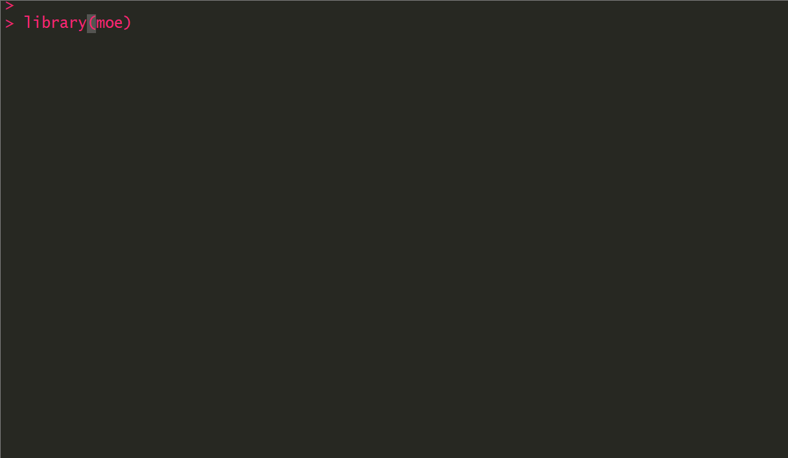

# moe

R package moe calculates margin of error for simple probability samples.



## Install

```
install.packages("devtools")
devtools::install_github("peterdalle/moe")
library(moe)
```

## Usage

```r
moe(proportion, n, conf.level = 0.95, digits = 2,
    population.correction = FALSE, population.size = NULL)
```

## Arguments

- `proportion` = value between 0 and 1 indicating the proportion, such as 0.30 for 30 percent.
- `n` = sample size.
- `conf.level` = confidence level (defaults to 0.95).
- `digits` = number of decimal digits used when formatting the results as APA and human-readable messages (defaults to 2).
- `population.correction` = whether or not results should be corrected by population size (defaults to FALSE).
- `population.size` = population size used by the population correction (defaults to NULL). Only used if population.correction is set to TRUE.

## Returns

a list with:

- `margin.of.error` = margin of error (in percentage points).
- `conf.level` = confidence level (in percentage points).
- `conf.lower` = confidence interval lower bound (in percentage points).
- `conf.upper` = confidence interval upper bound (in percentage points).
- `proportion` = proportion (same as input parameter).
- `percentage` = proportion expressed as percentage.
- `z.value` = z-value from normal distribution.
- `digits` = number of digits used to format APA confidence intervals.
- `n` = sample size (same as input parameter).
- `population.corrected` = whether or not the margin of error is corrected for population size (same as input parameter).
- `population.size` = population size (same as input parameter).
- `fpc` = finite population correction, between 0 and 1.
- `sampling.fraction` = sampling fraction, ratio of sample size to population size, between 0 and 1.
- `error.uncorrected` = margin of error before it is corrected for population size (in percentage points).
- `apa` = APA6 style formatted confidence intervals, such as 43.2%, 95% CI [40.1, 46.5].

## Examples

In this case, a political party got 30% in a sample of 1,200 voters.

```r
# Get margin of error.
moe(proportion=0.30, n=1200)
```

Which outputs:

```r
[1] 2.592789
```

Common methods such as `summary()` and `print()` are supported, as well as  `as.character()`, `as.double()`, and `as.integer()`.

With `summary()`, all available information is given:

```r
m <- moe(proportion=0.30, n=1200)
summary(m, digits=2)
```

Which outputs:

```
Parameters

  Margin of error:               2.592789 
  Proportion:                    0.3 (30%) 
  Confidence level:              95% 
  Confidence interval:           [27.41, 32.59] 
  Sample size:                   n = 1200 
  z-value:                       1.959964 
  APA6 style format:             30%, 95% CI [27.41, 32.59] 

Interpretation
  
  A share of 30% with a sample size of 1200 has a 95% confidence interval between
  27.41 and 32.59 percentage points, and the margin of error is plus/minus 2.59
  percentage points.
```

Using the `as.character()` method, you can extract the APA6 styled confidence intervals:

```r
# Get APA6 confidence intervals.
m <- moe(proportion=0.30, n=1200)
as.character(m, digits=2)
```

Which outputs:

```r
[1] "30%, 95% CI [27.41, 32.59]"
```

You can also extract specific data from the returned list:

```r
m <- moe(proportion=0.3, n=1200)
m$conf.lower
m$conf.upper
```

Which outputs:

```r
[1] 27.40721
[1] 32.59279
```

## Compare two proportions

A simple way to do a 2-sample test of proportions is to simply subtract one moe object from another.

```r
m1 <- moe(proportion=0.33, n=1200)
m2 <- moe(proportion=0.37, n=1200)

# Is the difference statistically significant?
m1 - m2
```

Which outputs:

```
Note: Using the 95% confidence level from 'm1'.

	2-sample test for equality of proportions with continuity correction

data:  c(proportion1, proportion2) out of c(n1, n2)
X-squared = 4.0458, df = 1, p-value = 0.04428
alternative hypothesis: two.sided
95 percent confidence interval:
 -0.078964583 -0.001035417
sample estimates:
prop 1 prop 2 
  0.33   0.37 
```

This subtraction is equivalent to `prop.test(x = c(0.33*1200, 0.37*1200), n = c(1200, 1200))` which gives identical result.

Thus, we can see that the two proportions differ significantly at the 0.05 alpha level.

The results from the test of proportions can also be saved, `res <- (m1 - m2)`, and then accessed like `res$p.value`.

## Correct margin of error for large samples

If your sample is large, you can correct for population size using [finite population correction](https://en.wikipedia.org/wiki/Standard_error#Correction_for_finite_population). In essence, the closer the sample size is to the population size, the smaller the margin of error will be. In everyday survey research (where typical n = 1,000 and population size is millions), however, the effect of population correction is trivial.

In this example, the sample is 50,000. We correct for population size (in this fictional country with 300,000 voters) and increase the confidence level to 99%.

```r
m <- moe(proportion=0.355, n=50000, conf.level=0.99, population.correction=TRUE, population.size=300000)
summary(m)
```

Which outputs:

```
Parameters

  Margin of error:               0.4593512 
  Proportion:                    0.355 (35.5%) 
  Confidence level:              99% 
  Confidence interval:           [35.04, 35.96] 
  Sample size:                   n = 50000 
  z-value:                       2.575829 
  APA6 style format:             35.5%, 99% CI [35.04, 35.96] 

Population correction

  Note: Margin of error and confidence intervals are corrected for population size.

  Population size:               N = 300000 
  Sampling fraction:             0.1666667 
  Finite population correction:  0.8333333 
  Uncorrected margin of error:   0.5512215 (difference: 0.09187024) 

Interpretation
  
  A share of 35.5% with a sample size of 50000 has a 99% confidence interval
  between 35.04 and 35.96 percentage points, and the margin of error is
  plus/minus 0.46 percentage points. These percentage points are corrected for
  the population size of 300000.
```

We also see that the margin of error before correction is 0.5512215 and after correction it is 0.4593512. These are percentage points, so the the difference (0.09187024) is not particularly large in this case.

The [sampling fraction](https://en.wikipedia.org/wiki/Sampling_fraction) is the ratio of sample size to population size, which is about 0.16. The closer the sampling fraction is to 1, the closer the sample size is to the population size.

## History

- 2018-08-20 Version 0.9.1 Uses S3 class and common generic methods, e.g. `summary()`.
- 2018-08-14 Version 0.9.0 First release.